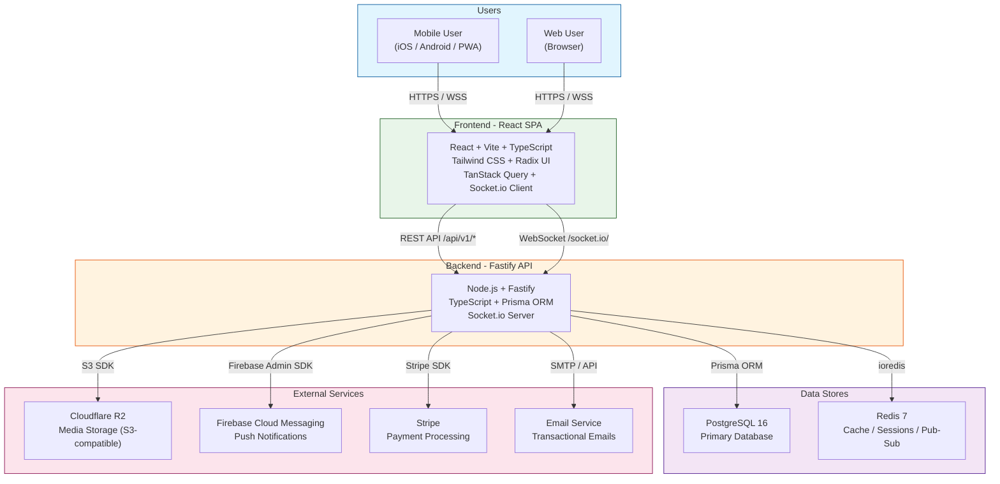
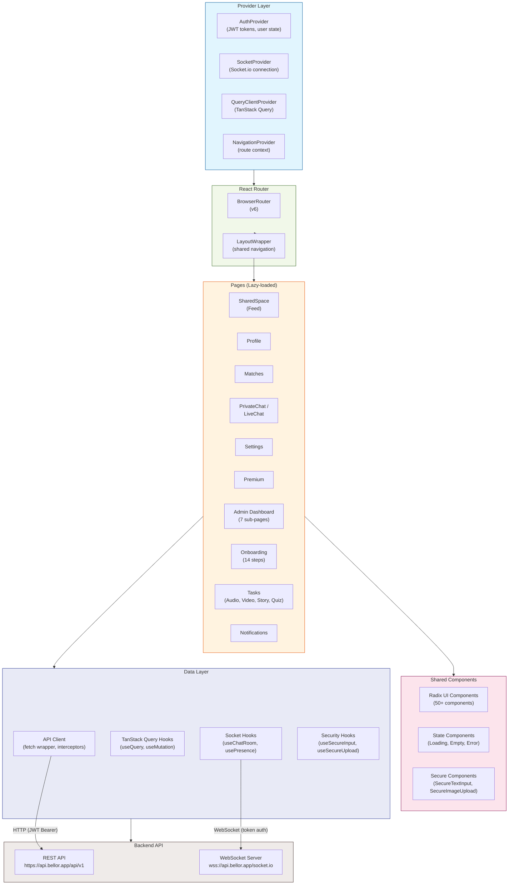
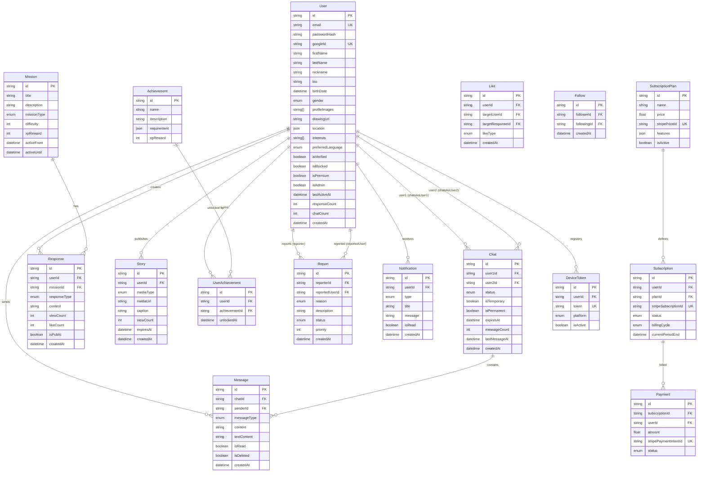
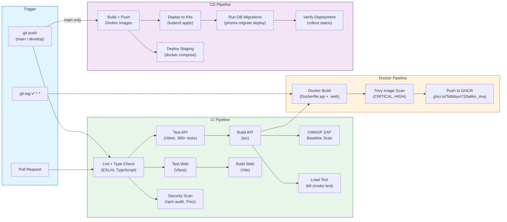
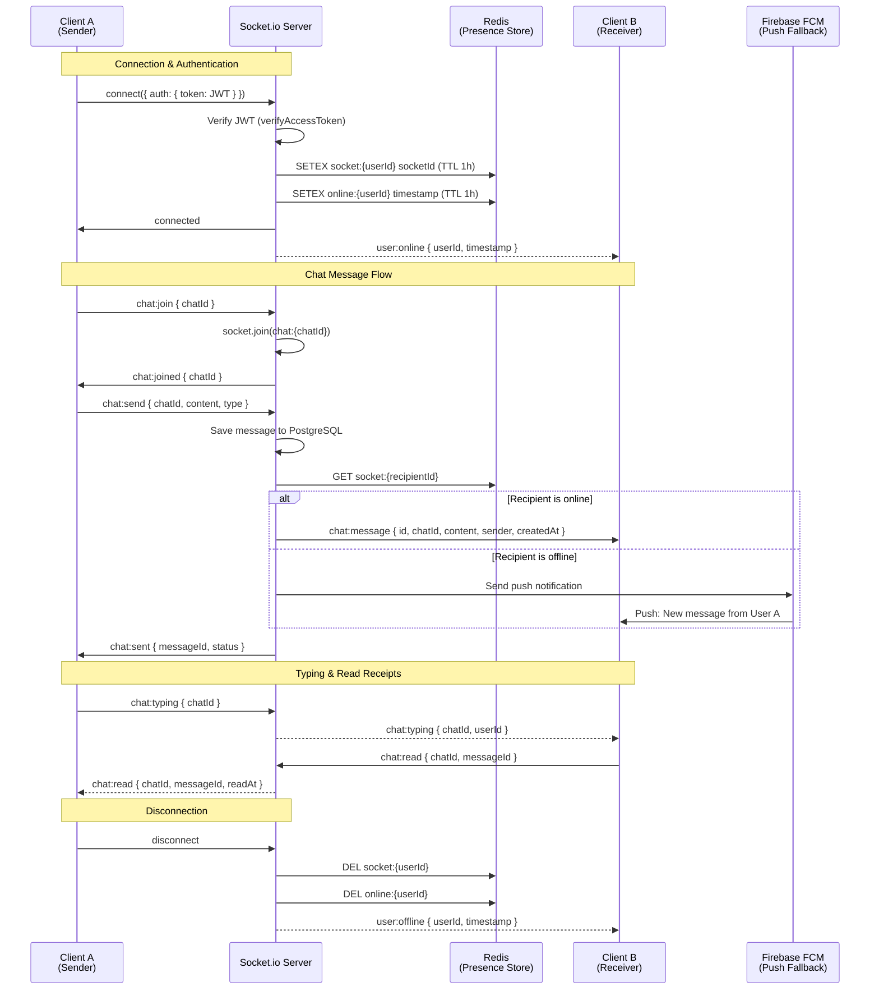
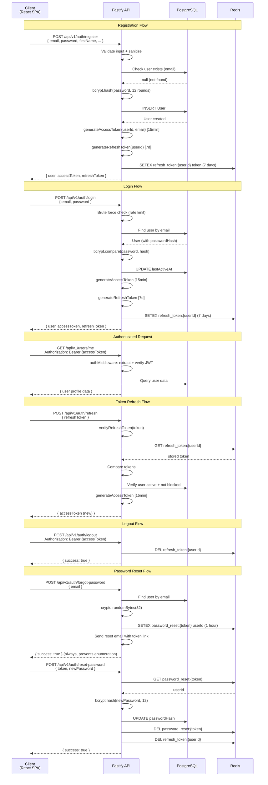

# Bellor MVP - Architecture Diagrams

Comprehensive architecture documentation for the Bellor dating/social application.
All diagrams use [Mermaid](https://mermaid.js.org/) syntax for rendering.

**Last Updated:** February 8, 2026

---

## Table of Contents

1. [System Overview (C4 Level 1)](#1-system-overview)
2. [Backend Architecture](#2-backend-architecture)
3. [Frontend Architecture](#3-frontend-architecture)
4. [Database Schema (ER Diagram)](#4-database-schema)
5. [Deployment Architecture](#5-deployment-architecture)
6. [CI/CD Pipeline](#6-cicd-pipeline)
7. [Real-time Communication Flow](#7-real-time-communication-flow)
8. [Authentication Flow](#8-authentication-flow)

---

## 1. System Overview

High-level view of the Bellor system showing the main components and their interactions.
Users interact with a React SPA, which communicates with the Fastify API over HTTPS and WebSocket.
The API layer manages persistence in PostgreSQL, caching/sessions in Redis, media storage in Cloudflare R2, and push notifications through Firebase Cloud Messaging.

---

## 2. Backend Architecture

The backend follows a layered architecture: Routes register endpoints, middleware handles cross-cutting concerns (authentication, validation, rate limiting, security), and services contain the business logic.
Services interact with Prisma for database access, Redis for caching, and external APIs for third-party integrations.

```mermaid
graph LR
    subgraph Middleware["Middleware Layer"]
        Auth["Auth Middleware<br/>(JWT Bearer)"]
        BruteForce["Brute Force<br/>Protection"]
        Security["Security Middleware<br/>(Sanitization, Headers)"]
        RateLimit["Rate Limiting<br/>(Redis-backed)"]
        CORS["CORS<br/>(@fastify/cors)"]
        Helmet["Helmet<br/>(HTTP Security Headers)"]
        Logging["Logging Middleware<br/>(Pino)"]
    end

    subgraph Routes["API Routes (/api/v1)"]
        AuthR["/auth<br/>register, login, refresh, logout"]
        UsersR["/users<br/>CRUD, profiles, preferences"]
        ChatsR["/chats<br/>messaging, temporary/permanent"]
        MissionsR["/missions<br/>daily challenges"]
        ResponsesR["/responses<br/>mission responses"]
        StoriesR["/stories<br/>24h ephemeral content"]
        LikesR["/likes<br/>romantic, positive, super"]
        FollowsR["/follows<br/>follow system"]
        NotifR["/notifications<br/>in-app notifications"]
        AchR["/achievements<br/>badges, XP rewards"]
        AdminR["/admin<br/>dashboard, moderation"]
        SubsR["/subscriptions<br/>premium, Stripe"]
        UploadsR["/uploads<br/>file storage"]
        WebhooksR["/webhooks<br/>Stripe callbacks"]
        DevTokensR["/device-tokens<br/>push notification registration"]
        OAuthR["/oauth<br/>Google OAuth"]
    end

    subgraph Services["Service Layer"]
        AuthS["AuthService"]
        UserS["UsersService"]
        ChatS["ChatService"]
        MissionS["MissionsService"]
        ResponseS["ResponsesService"]
        StoryS["StoriesService"]
        LikeS["LikesService"]
        FollowS["FollowsService"]
        NotifS["NotificationsService"]
        AchS["AchievementsService"]
        AnalyticsS["AnalyticsService"]
        SubsS["SubscriptionsService"]
        StorageS["StorageService"]
        PushS["PushNotificationsService"]
        ReportS["ReportsService"]
    end

    subgraph DataAccess["Data Access Layer"]
        Prisma["Prisma ORM<br/>PostgreSQL Client"]
        RedisClient["Redis Client<br/>(ioredis)"]
        S3Client["S3 Client<br/>(Cloudflare R2)"]
        FCMClient["Firebase Admin<br/>(FCM)"]
        StripeClient["Stripe SDK"]
    end

    Middleware --> Routes
    Routes --> Services
    Services --> DataAccess

    style Middleware fill:#fff9c4,stroke:#f57f17
    style Routes fill:#e8f5e9,stroke:#1b5e20
    style Services fill:#e3f2fd,stroke:#0d47a1
    style DataAccess fill:#f3e5f5,stroke:#4a148c
```

---

## 3. Frontend Architecture

The React frontend uses a provider-based architecture with context for auth and socket state,
TanStack Query for server-state management, and React Router for navigation.
Lazy-loaded pages are wrapped in a shared layout with a navigation system.

---

## 4. Database Schema

Entity-Relationship diagram showing the core database models and their relationships.
The schema is managed by Prisma and runs on PostgreSQL 16.

---

## 5. Deployment Architecture

Production deployment uses Kubernetes with nginx Ingress for SSL termination and routing.
The API scales via HPA (3-20 pods), with PostgreSQL and Redis as managed or self-hosted data stores.
Monitoring is provided by Prometheus scraping the /metrics endpoint, with Grafana dashboards and Loki for log aggregation.

```mermaid
graph TB
    subgraph Internet["Internet"]
        Client["Users<br/>(Browser / Mobile App)"]
    end

    subgraph K8sCluster["Kubernetes Cluster (bellor namespace)"]
        subgraph Ingress["nginx Ingress Controller"]
            IngressLB["nginx LB<br/>SSL/TLS Termination<br/>Let's Encrypt<br/>Rate Limiting"]
        end

        subgraph FrontendPods["Frontend Pods"]
            Web1["bellor-web Pod 1<br/>(nginx + SPA)"]
            Web2["bellor-web Pod 2<br/>(nginx + SPA)"]
            WebHPA["HPA: 2-10 replicas<br/>CPU target: 70%"]
        end

        subgraph APIPods["API Pods"]
            API1["bellor-api Pod 1<br/>(Node.js + Fastify)"]
            API2["bellor-api Pod 2<br/>(Node.js + Fastify)"]
            API3["bellor-api Pod 3<br/>(Node.js + Fastify)"]
            APIHPA["HPA: 3-20 replicas<br/>CPU: 65% / Mem: 75%<br/>PDB: minAvailable=2"]
        end

        subgraph DataLayer["Data Layer"]
            PG["PostgreSQL 16<br/>bellor-postgres<br/>1G memory limit"]
            Redis["Redis 7<br/>bellor-redis<br/>256M memory limit<br/>AOF persistence"]
        end

        subgraph Monitoring["Monitoring Stack"]
            Prometheus["Prometheus<br/>Scrapes /metrics"]
            Grafana["Grafana<br/>Dashboards"]
            Loki["Loki<br/>Log Aggregation"]
        end
    end

    subgraph External["External Services"]
        R2["Cloudflare R2<br/>CDN + Storage"]
        FCM["Firebase FCM"]
        StripeSvc["Stripe"]
    end

    Client -->|HTTPS :443| IngressLB
    IngressLB -->|"bellor.app"| Web1
    IngressLB -->|"bellor.app"| Web2
    IngressLB -->|"api.bellor.app"| API1
    IngressLB -->|"api.bellor.app"| API2
    IngressLB -->|"api.bellor.app"| API3
    IngressLB -->|"/socket.io/ (sticky)"| API1

    API1 --> PG
    API2 --> PG
    API3 --> PG
    API1 --> Redis
    API2 --> Redis
    API3 --> Redis

    API1 --> R2
    API1 --> FCM
    API1 --> StripeSvc

    Prometheus -->|scrape /metrics| API1
    Prometheus -->|scrape /metrics| API2
    Prometheus -->|scrape /metrics| API3
    Grafana --> Prometheus
    Grafana --> Loki

    WebHPA -.->|autoscale| FrontendPods
    APIHPA -.->|autoscale| APIPods

    style Internet fill:#e1f5fe,stroke:#01579b
    style K8sCluster fill:#f5f5f5,stroke:#616161
    style Ingress fill:#fff9c4,stroke:#f57f17
    style FrontendPods fill:#e8f5e9,stroke:#1b5e20
    style APIPods fill:#fff3e0,stroke:#e65100
    style DataLayer fill:#f3e5f5,stroke:#4a148c
    style Monitoring fill:#e0f2f1,stroke:#004d40
    style External fill:#fce4ec,stroke:#880e4f
```

---

## 6. CI/CD Pipeline

The CI/CD pipeline runs on GitHub Actions with four workflows:
**CI** (lint, test, build, security scan), **Test** (unit, E2E, Playwright),
**Docker Build** (image build, vulnerability scan), and **CD** (deploy to K8s or staging via Docker Compose).

---

## 7. Real-time Communication Flow

WebSocket communication uses Socket.io with JWT authentication on the handshake.
Redis is used for presence tracking (online/offline) and cross-pod message delivery.
Clients receive real-time events for chat messages, typing indicators, read receipts, and presence updates.

---

## 8. Authentication Flow

Authentication uses JWT with short-lived access tokens (15 minutes) and long-lived refresh tokens (7 days, stored in Redis).
Brute force protection is applied to the login endpoint.
Password reset uses a one-time cryptographic token stored in Redis with a 1-hour expiry.

---

## Appendix: Technology Stack Summary

| Layer | Technology | Purpose |
|-------|-----------|---------|
| **Frontend** | React 18 + Vite + TypeScript | SPA framework |
| **UI Components** | Radix UI + Tailwind CSS | Design system (50+ components) |
| **State Management** | TanStack Query (React Query) | Server-state caching |
| **Routing** | React Router v6 | Client-side routing |
| **Real-time (Client)** | Socket.io Client | WebSocket communication |
| **Backend** | Node.js + Fastify + TypeScript | API server |
| **ORM** | Prisma | Database access layer |
| **WebSocket (Server)** | Socket.io | Real-time events |
| **Database** | PostgreSQL 16 | Primary data store |
| **Cache/Sessions** | Redis 7 | Caching, tokens, presence |
| **Media Storage** | Cloudflare R2 | S3-compatible object storage |
| **Push Notifications** | Firebase Cloud Messaging | Mobile/web push |
| **Payments** | Stripe | Subscriptions, payments |
| **Auth** | JWT (access 15min + refresh 7d) | Authentication |
| **Container** | Docker (multi-stage builds) | Packaging |
| **Orchestration** | Kubernetes | Production deployment |
| **Ingress** | nginx | SSL termination, load balancing |
| **CI/CD** | GitHub Actions | Automation pipeline |
| **Security Scanning** | Trivy, OWASP ZAP, npm audit | Vulnerability scanning |
| **Load Testing** | k6 | Performance benchmarks |
| **Monitoring** | Prometheus + Grafana + Loki | Metrics, dashboards, logs |
| **Mobile** | Capacitor | iOS + Android wrappers |
